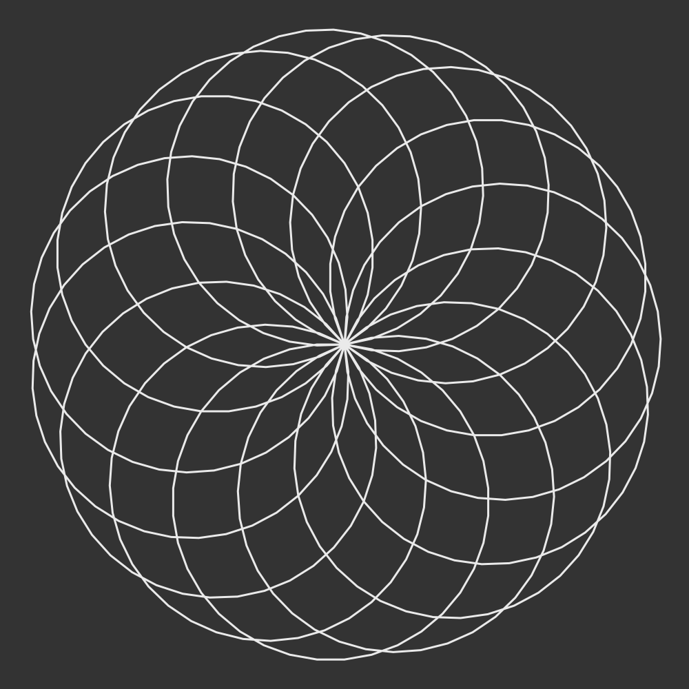
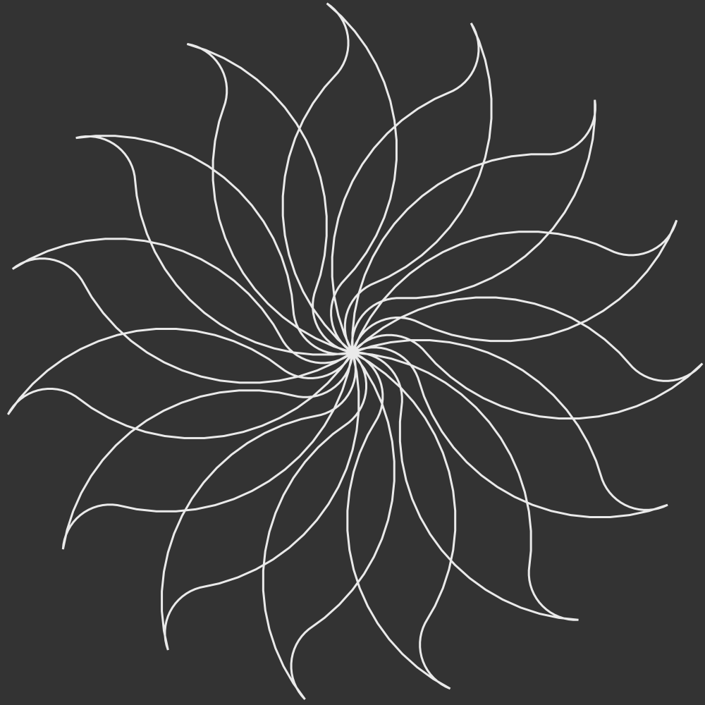

# Turtle Ait

Got inspired by [AshleyF's Turtle graphics in ForthKit](https://github.com/AshleyF/Forthkit/tree/master/library/turtle) and made this little thing with Ait.

## Local

`npm i && npm start` to see a local copy.

## Result

